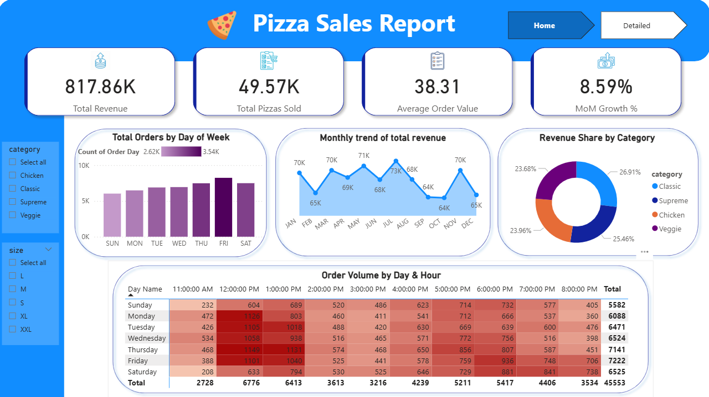

# 🍕 Pizza Sales Report – Power BI Dashboard

### 📊 End-to-End Business Intelligence Project

This repository contains an interactive Power BI dashboard built to analyze pizza sales performance across different categories, sizes, time periods, and menu items. The report provides actionable insights that help enhance menu strategy, improve operations, and drive revenue growth.

---

## 🔍 Project Overview

The dashboard answers key business questions such as:

- Which pizza categories generate the highest revenue?
- Which days and hours have the most orders?
- What are the best-selling and lowest-performing menu items?
- How does monthly revenue trend over time?
- Which pizza sizes contribute the most to revenue?

This project includes:

- Data Cleaning & Transformation (Power Query)  
- Data Modeling (Star Schema)  
- DAX Measures  
- KPI Indicator Cards  
- Interactive Visualizations & Filters  
- Multi-page analytics  

---

## 🚀 Key Performance Indicators (KPIs)

- **Total Revenue:** 817.86K  
- **Total Pizzas Sold:** 49.57K  
- **Average Order Value:** 38.31  
- **MoM Growth:** 8.59%  

---

## 📸 Dashboard Preview

### 🎯 Home Page – Summary Dashboard


---

### 📊 Detailed Insights Page


---

## 🧱 Data Model (Star Schema)

This Power BI project uses a clean and optimized star schema design for efficient reporting.


---

## 🔢 DAX Measures Used

```DAX
Total Revenue = SUMX(order_details,order_details[quantity]*RELATED(pizzas[price]))

Total Pizzas Sold = SUM(order_details[quantity])

Average Order Value = [Total Revenue]/DISTINCTCOUNT(orders[order_id])

MoM Growth % = 
VAR PrevMonth = [Sales Last Month]
RETURN
IF(ISBLANK(PrevMonth), BLANK(), DIVIDE([Total Revenue] - PrevMonth, PrevMonth))

